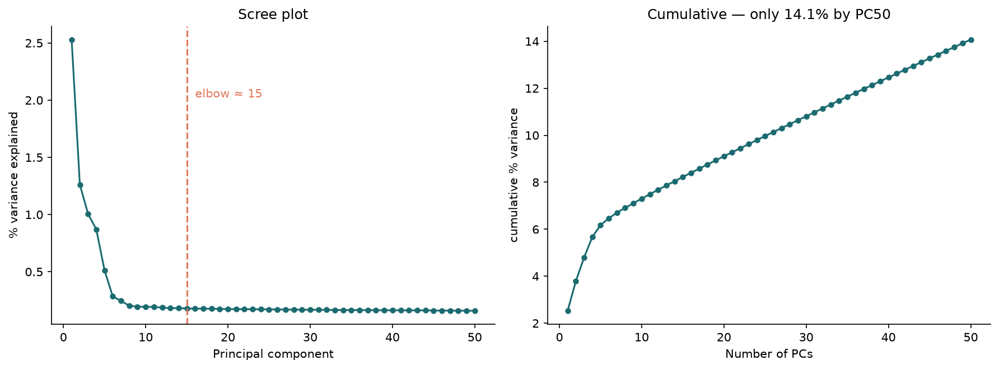
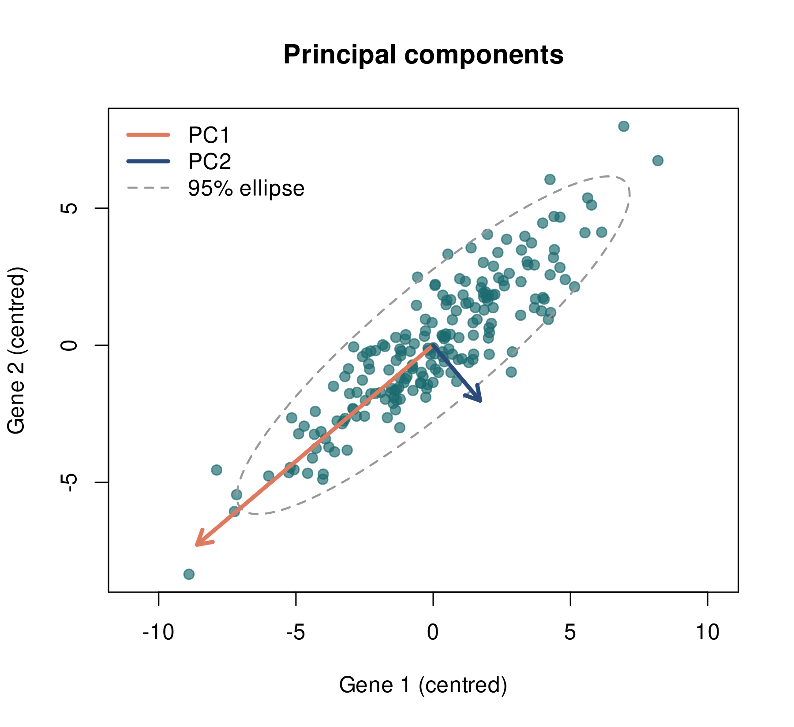
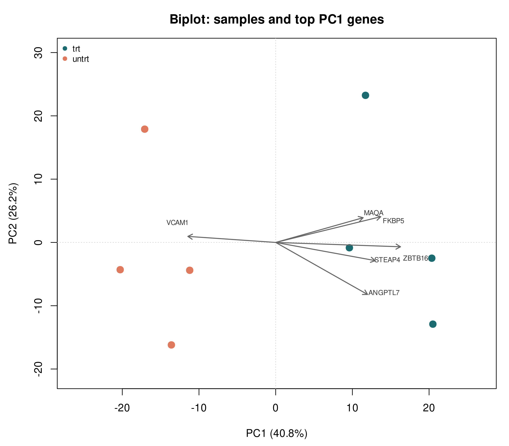
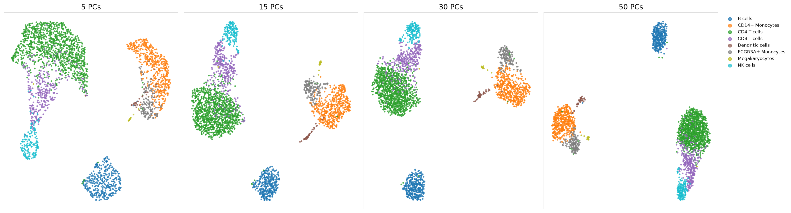
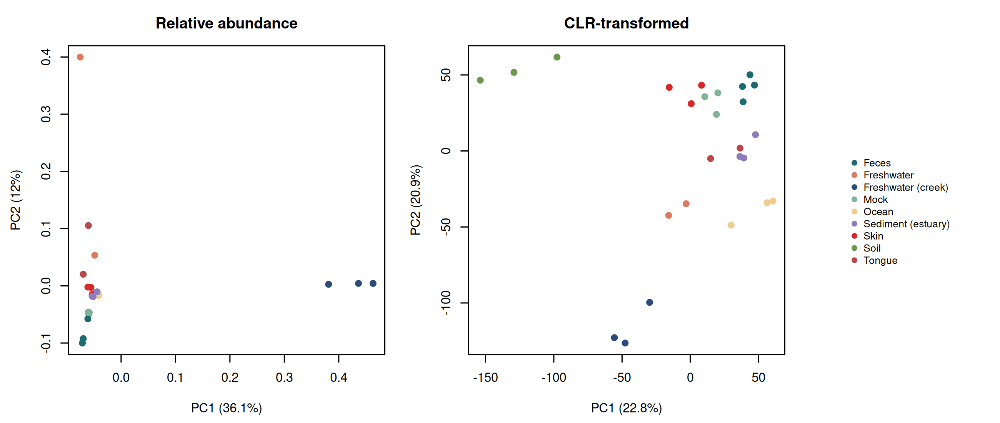

# PCA in Biological Data

What principal component analysis actually does, and how it behaves differently on bulk
RNA-seq, single-cell RNA-seq, and microbiome data.

> Learning project. Public datasets, meant to be read and re-run.

PCA is usually the first thing you run on a new dataset and the last thing anyone
explains. These four notebooks work through it on three data types, using the
transformation and interpretation each one actually needs.



---

## Notebooks

| Notebook | Data | Question |
|---|---|---|
| `01_pca_from_scratch.Rmd` | Two simulated variables | What is PCA doing, and why does scaling change the answer? |
| `02_bulk_rnaseq_pca.Rmd` | `airway`, 8 samples | What does PC1 represent biologically, and how many components should you keep? |
| `03_scrnaseq_pca.ipynb` | PBMC3K, 2,638 cells | Why keep 30–50 PCs before UMAP? |
| `04_microbiome_pca.Rmd` | `GlobalPatterns`, 26 samples | Why does PCA fail on relative abundances, and does the fix change the statistics? |

R for bulk RNA-seq and microbiome, Python for single-cell — matching what each field
uses. The notebooks are independent; read them in any order.

---

## 01 — From scratch

PCA rotates the coordinate system so the axes point along directions of maximum
variance. Built here from the covariance matrix and its eigenvectors on two correlated
variables, then checked against `prcomp()`.



The 95% ellipse *is* the covariance matrix drawn as a shape; the components are its
major and minor axes. After rotation the off-diagonal covariance is exactly zero — that
is the whole operation.

The last section multiplies one variable by 100. Nothing biological changes, but PC1
goes from loading -0.707 on both variables to -1.000 on one and -0.010 on the other,
and reports 100% variance explained instead of 94.6%. That is the argument for thinking
about scaling before running PCA.

## 02 — Bulk RNA-seq

Dexamethasone-treated airway smooth muscle cells, four donors, paired design.

After VST, PC1 (41%) separates treated from untreated and PC2 (26%) separates donors.
The top PC1 loadings are FKBP5, TSC22D3, KLF15, ZBTB16, DUSP1 — canonical glucocorticoid
receptor targets. PC1 is a nameable transcriptional programme, not an abstraction.



Every arrow except VCAM1 points towards the treated samples: the glucocorticoid
programme switching on. VCAM1, an inflammatory adhesion molecule, points the other way.

Six genes rather than the top ten, because several of the strongest loadings point
almost identically — ZBTB16, GPX3, SAMHD1 and KLF15 sit within 0.01 of each other on
PC2, so their arrows overlap and no label placement can separate them. A biplot with too
many arrows shows less, not more.

Without VST, **PC1 correlates -0.89 with library size**. After VST, **-0.17**. The plot
still appears to separate treatment, but the axis is mostly sequencing depth.

| Transform | PC1 % | PC2 % | PC1 vs library size |
|---|---:|---:|---:|
| raw log2(counts+1) | 34.6 | 20.4 | **-0.890** |
| VST | 40.8 | 26.2 | -0.166 |

The notebook also measures **reconstruction error** — how much information truncating
to *k* components discards. Four PCs reach 96.8% of the variance and drop the error
from 0.754 to 0.041. It is a quantitative alternative to eyeballing the scree elbow,
and it works here because bulk data compresses well. Notebook 03 shows where it fails.

## 03 — Single-cell RNA-seq

PBMC3K. PC1 explains 2.53% of variance; fifty PCs together explain **14.1%**. Nothing
like the 41% PC1 of the bulk data — single-cell variance is spread thin across thousands
of dimensions, most of it dropout noise.



Identical UMAP settings on 5, 15, 30, and 50 principal components. Only the number of
PCs used to build the nearest-neighbour graph differs. At 5 PCs the T cell subsets
merge; by 15 they separate; 30 and 50 are barely distinguishable.

You keep 30–50 PCs not because they explain most of the variance, but because what they
leave out is mostly noise. Demanding 90% of the variance here — the rule that worked on
bulk data — would mean keeping hundreds of components, most of them dropout.

## 04 — Microbiome

16S sequencing across nine environment types.



PCA on relative abundances puts 36.1% of variance on PC1 — and PC1 turns out to be a
cyanobacterial bloom in three freshwater creek samples. Soil, ocean, gut, skin and
tongue collapse into one indistinguishable cluster.

Relative abundances are compositional: they sum to 1, so the data lives on a simplex
rather than in the Euclidean space PCA assumes. After a centred log-ratio transform,
PC1 drops to 22.8% and every environment type separates.

**The representation determines the ordination.** Same 26 samples, three ways of
representing them:

| Representation | Method | Axis 1 | Axis 2 |
|---|---|---:|---:|
| Relative abundance | PCA | 36.1% | 12.0% |
| CLR-transformed counts | PCA | 22.8% | 20.9% |
| Bray-Curtis distances | PCoA | 14.8% | 12.3% |

**And it determines what the statistics can conclude.** PERMANOVA on Bray-Curtis gives
R² = 0.733 (p = 0.001) — but `betadisper` shows within-group dispersion also differs
(p = 0.001), so the test cannot separate a difference in location from a difference in
spread. On Aitchison distance (Euclidean on CLR) the effect size is larger and the
dispersion check comes back clean:

| Distance | PERMANOVA R² | betadisper p | Confounded? |
|---|---:|---:|---|
| Bray-Curtis | 0.733 | **0.001** | yes |
| Aitchison (CLR) | **0.805** | 0.101 | no |

Taking compositionality seriously is not a cosmetic choice about how the plot looks.

---

## Common mistakes, and where each is demonstrated

- **PCA on raw counts** — PC1 becomes sequencing depth (r = -0.89, notebook 02). Use
  VST, rlog, or log-CPM first.
- **Scaling without thinking about it** — a unit change alone can make PC1 meaningless
  (notebook 01). Scale when features are on different scales; usually don't after VST.
- **PCA on relative abundances** — one dominant taxon takes over (notebook 04). Use CLR,
  or PCoA on Bray-Curtis.
- **Reading PC1 as biology without checking** — in notebook 02 the same plot shape means
  glucocorticoid response after VST and library size without it. Correlating your PCs
  against library size, batch, and collection date takes one line.
- **Treating variance-explained as a quality score** — notebook 04 shows 36.1% being
  worse than 22.8%.
- **Applying a bulk rule of thumb to single-cell** — "keep 90% of the variance" gives
  four PCs on `airway` and hundreds on PBMC3K (notebooks 02 and 03).
- **Crowding a biplot** — genes with near-identical loadings produce overlapping arrows
  that cannot be told apart (notebook 02).
- **Reporting PERMANOVA without `betadisper`** — a significant result can come from
  unequal dispersion rather than different centroids (notebook 04).

---

## Normalization vs standardization

These terms are often used interchangeably, but they are not the same thing.

**Normalization** in genomics accounts for technical or compositional differences
between samples — library size, sequencing depth, gene length, compositional effects.
VST, CPM, TPM, and CLR are examples used in different biological settings.

**Standardization** (z-scoring) rescales features to a common scale, typically mean 0
and standard deviation 1. In R this is what `scale. = TRUE` in `prcomp()` does; in
scanpy it is `sc.pp.scale()`.

**Machine learning uses the word differently.** "Normalization" there often means
rescaling values to a fixed range such as [0, 1], while "standardization" means
z-scoring. Reading an ML tutorial and a DESeq2 vignette in the same afternoon is where
most of the confusion comes from.

The useful question is not *"should I normalize?"* or *"should I standardize?"* but
what the transformation means for this particular type of biological data.

The notebooks show four cases: standardization in the simulated example, VST for bulk
RNA-seq, CLR for microbiome data, and normalization followed by standardization on
selected genes for single-cell.

---

## Running the notebooks

R notebooks:

```r
install.packages(c("BiocManager", "compositions", "vegan", "ellipse"))
BiocManager::install(c("DESeq2", "airway", "phyloseq"))
```

Python notebook:

```bash
pip install scanpy leidenalg
```

`airway` and `GlobalPatterns` ship with their packages — no downloads. Notebook 03
expects PBMC3K at `data/pbmc3k.h5ad` with labels in `obs["cell_type"]`; it comes from
`scanpy.datasets.pbmc3k()` and `pbmc3k_processed()`.

The `.Rmd` files knit to `github_document`, so the `.md` versions render with figures
directly on GitHub.

---

## Layout

```text
PCA-in-Biological-Data/
│
├── notebooks/
│   ├── 01_pca_from_scratch.Rmd
│   ├── 02_bulk_rnaseq_pca.Rmd
│   ├── 03_scrnaseq_pca.ipynb
│   └── 04_microbiome_pca.Rmd
│
├── figures/          # generated plots
├── results/          # variance tables and summary CSVs
├── data/             # inputs (not tracked)
│
└── README.md
```

Result tables: `scaling_effect_example.csv`, `vst_effect_on_pca.csv`,
`pc1_loadings_airway.csv`, `reconstruction_error_airway.csv`,
`pca_variance_pbmc3k.csv`, `silhouette_by_npcs.csv`,
`ordination_by_representation.csv`, `ordination_tests.csv`.

---

## What isn't here

PCA assumes linearity and Euclidean geometry. When those assumptions fail it remains
useful for QC but stops being the right tool for visualisation. Notebook 04 covers PCoA
as one alternative. Not covered:

- **NMDS** — ordination on ranks rather than distances.
- **UniFrac** — a phylogeny-aware distance, standard in microbiome work and available
  in `phyloseq`. Neither Bray-Curtis nor Aitchison distance uses the tree.
- **UMAP and t-SNE** — nonlinear, visualisation only. Used in notebook 03 but not
  explained. Worth noting both are run *on* principal components rather than raw data,
  which is why PCA still matters when the final figure is a UMAP.
- **Sparse and robust PCA variants.**

---

## Datasets

| Dataset | Source | Used for |
|---|---|---|
| `airway` | Bioconductor `airway` — Himes et al. (2014) | Bulk RNA-seq |
| PBMC3K | 10x Genomics, via `scanpy.datasets` | Single-cell RNA-seq |
| `GlobalPatterns` | Bioconductor `phyloseq` — Caporaso et al. (2011) | Microbiome |

---

## Learning Notes

The goal was a set of small reproducible notebooks explaining PCA in the contexts where
it is actually used, with the emphasis on assumptions rather than function calls.

Nothing here is a novel result. The datasets are public and well studied; what the
notebooks add is showing what breaks when the preprocessing is wrong, and by how much.

**Corrections welcome.**

---

## References

- Jolliffe IT & Cadima J (2016). Principal component analysis: a review and recent
  developments. *Phil Trans R Soc A* 374:20150202.
- Himes BE et al. (2014). RNA-Seq transcriptome profiling identifies CRISPLD2 as a
  glucocorticoid responsive gene. *PLoS One* 9:e99625.
- Wolf FA, Angerer P & Theis FJ (2018). SCANPY: large-scale single-cell gene expression
  data analysis. *Genome Biology* 19:15.
- McMurdie PJ & Holmes S (2013). phyloseq: an R package for reproducible interactive
  analysis of microbiome census data. *PLoS One* 8:e61217.
- Aitchison J (1982). The statistical analysis of compositional data. *J R Stat Soc B*
  44:139–177.
- Anderson MJ (2001). A new method for non-parametric multivariate analysis of variance.
  *Austral Ecology* 26:32–46.

## License

MIT
